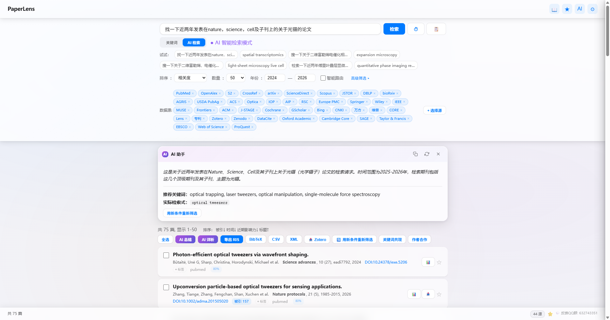
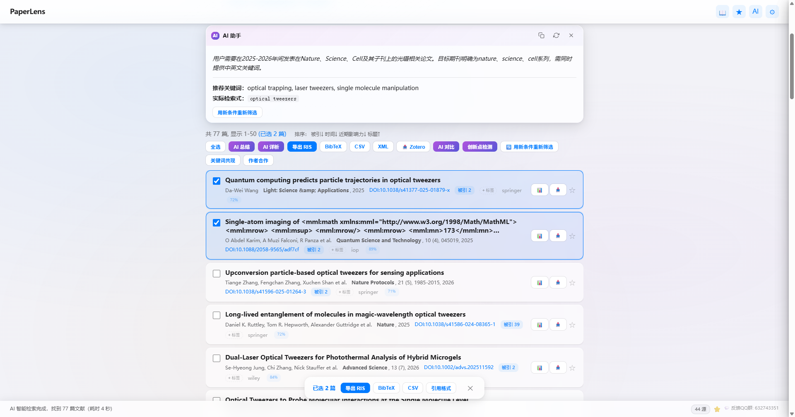
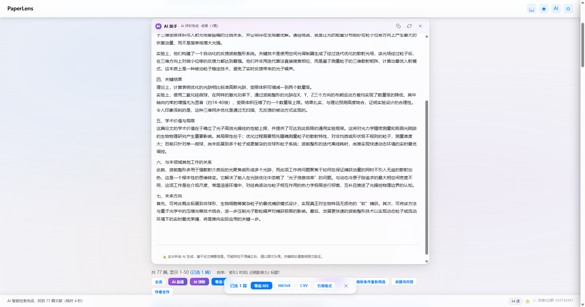
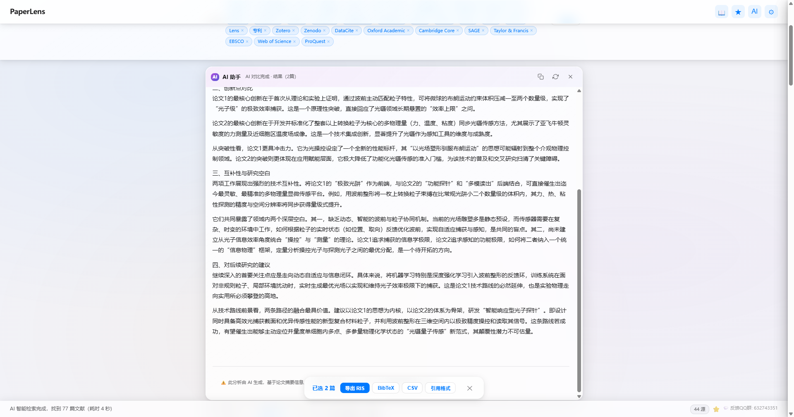
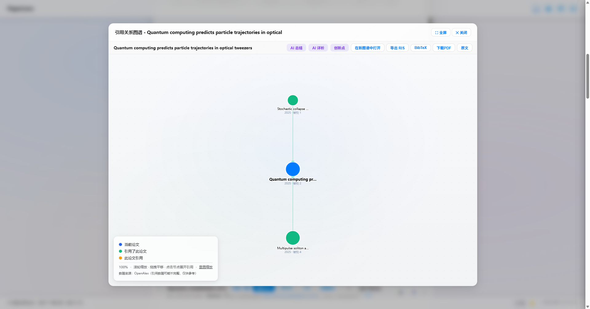
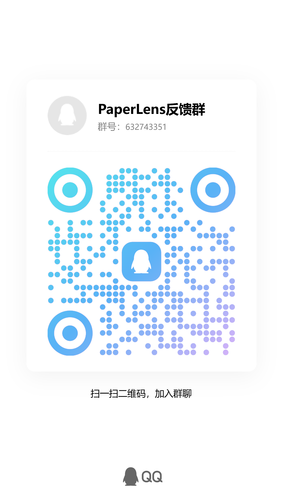

<p align="center">
  <b>中文</b> | <a href="README.md">English</a>
</p>

<p align="center">
  <h1 align="center">PaperLens</h1>
  <p align="center"><b>你的 AI 科研副驾驶</b></p>
  <p align="center"><i>别再搜论文了，直接理解研究。</i></p>
  <p align="center">
    
    
    
    
    
    
  </p>
</p>

<p align="center">
  <a href="https://vanthree31.github.io/PaperLens/promo.html">
    
  </a>
  <a href="https://vanthree31.github.io/PaperLens/promo-zh.html">
    
  </a>
</p>

<!-- TODO: Hero demo GIF — 8-10s 展示完整流程：输入研究问题 → 结果出现 → 打开论文 → AI 分析面板 → 引用图谱。文件: assets/demo.gif -->

---

## PaperLens 是什么？

PaperLens 是一个 **AI 科研副驾驶**。它把文献工作从"来回切换十几个网站"变成一个连贯的流程。可以理解为 **科研版的 Cursor**。

大多数科研人每天的日常：Google Scholar → arXiv → 打开 PDF → 不是我要的 → 继续搜 → 开一堆标签页 → 最后自己都搞不清楚看了什么。

PaperLens 用一个工具替代所有这些：

```
找 → 筛 → 读 → 懂 → 存 → 引
```

- **43 个学术数据库**并发搜索，包括 PubMed、Scopus、ScienceDirect、arXiv、CNKI 等
- **300+ 中国高校 CARSI 直连** — 无需 VPN，随时随地访问 ScienceDirect、Scopus、JSTOR
- **100% 本地优先** — 数据不出你的电脑。支持 Ollama 完全离线运行。无需注册账号。

---

## 演示

| 搜索与发现 | 论文列表 | AI 详析 |
|:---:|:---:|:---:|
|  |  |  |

| 多篇对比 | 引用图谱 |
|:---:|:---:|
|  |  |

---

## 为什么需要 PaperLens？

### 没有 PaperLens 的一天

Google Scholar → arXiv → 打开 PDF → 发现不是我要的 → 继续搜 → 继续点 → 最后开了 20 个标签页，还是一头雾水。

### 有了 PaperLens

用自然语言描述你的研究问题。PaperLens **同时搜 43 个数据库**，按相关性排序，然后：

- **2 分钟读懂一篇论文，而不是 30 分钟** — AI 提取方法、创新点、优势、局限、未来方向
- **几秒找到合适的论文，而不是几小时** — AI 理解你的研究意图，不是简单关键词匹配
- **多篇论文对比着看** — 发现矛盾、识别研究空白、找到互补方法
- **发现隐藏关联** — 交互式引用图谱展示论文间的引用关系、合作网络、研究聚类

| 痛点 | PaperLens 方案 |
|------|---------------|
| 校外访问 ScienceDirect/Scopus 需要 VPN | **CARSI 认证** — 300+ 高校，零配置直连 |
| 不会写 Boolean 检索式 | **自然语言** — 中文描述研究方向，AI 自动构建检索式 |
| 在 PubMed、Scopus、Google Scholar、CNKI 间反复横跳 | **43 个源，一键搜索** — 结果自动合并去重 |
| 读 50 篇论文写文献综述 | **AI 详析** — 七维度拆解 + 多篇对比 |
| 难以发现跨领域关联 | **交互式引用图谱**（D3.js）— 点击展开，拖拽探索 |
| 担心云端工具数据隐私 | **100% 本地** — Ollama 完全离线，数据不出本机 |

---

## 科研工作流

PaperLens 不只是搜索工具，它是一个完整的流程：

### 1. 找
用自然语言描述研究方向。PaperLens AI 自动构建最优检索式，**43 个学术数据库**并发搜索 — PubMed、OpenAlex、CrossRef、arXiv、Semantic Scholar、ScienceDirect、Scopus、JSTOR、CNKI、万方、维普、Google Scholar 等。结果自动去重、充实、排序，几秒内呈现。

### 2. 筛
按期刊、年份、领域标签、文献类型、元数据完整度筛选。每篇论文都有 **元数据评分（0-100%）**，哪些字段缺失一目了然。

### 3. 读
选中任意论文。AI 提取核心内容：

```
总结  →  详析  →  方法  →  创新点  →  优势  →  局限  →  未来方向  →  相关论文
```

这不是一句话摘要。这是 **完整的七维度结构化拆解** — 就像有一个师兄/师姐帮你把论文讲透。

### 4. 懂
多篇论文对比着看。AI 帮你识别：
- 不同方法的异同和优劣
- 没人触及的研究空白
- 结论之间的矛盾
- 有前景的未来方向

### 5. 存与引
多格式导出：**RIS、BibTeX、CSV、EndNote XML**。引文格式化：**APA 7th、MLA 9th、GB/T 7714、Chicago 17th、Vancouver**。追踪阅读状态（未读/阅读中/已读）。标签与 Zotero 双向同步。OA PDF 一键下载。

---

## 核心功能

### AI 搜索
- **43 个数据源**并发搜索 — 完整列表见 [ROADMAP.md](ROADMAP.md)
- **自然语言** — 中文或英文，AI 理解你的研究意图
- **批量 DOI 导入** — 粘贴 DOI 列表，一键充实元数据
- **智能筛选** — 期刊、年份、领域标签、文献类型、元数据完整度
- **渐进式渲染** — 搜到就显示，不用等全部完成

### AI 详析
- **总结** — 一段话：做了什么、怎么做的、为什么重要
- **详析** — 7 维度：贡献、动机、方法、结果、局限、背景、未来方向
- **多篇对比** — 系统比较方法、创新点、互补性、研究空白
- **创新点检测** — 发现未充分探索的领域、文献中的矛盾、有前景的方向

### CARSI 机构访问
通过 CARSI 连接 **300+ 中国高校**。**无需 VPN**，随时随地访问 ScienceDirect、Scopus、JSTOR 等机构数据库。

| 数据源 | 状态 | 认证方式 |
|--------|------|----------|
| ScienceDirect | ✅ | CARSI |
| Scopus | ✅ | CARSI |
| JSTOR | ✅ | CARSI |
| CNKI | ✅ | CARSI + 验证码 |

### 交互式引用图谱
- **D3.js 力导向图** — 缩放、平移、拖拽、点击展开
- **关键词共现网络** — 发现主题聚类
- **作者合作网络** — 查看合著关系
- 点击任意节点实时加载引用与被引论文

### 导出与集成
- **多格式导出** — RIS、BibTeX、CSV、EndNote XML
- **引文格式化** — APA 7th、MLA 9th、GB/T 7714、Chicago 17th、Vancouver
- **Zotero 集成** — SQLite 直读 + MCP 插件 + 标签双向同步 + PDF 全文提取
- **标签系统** — 自定义标签 + 自由色盘 + Zotero 同步
- **阅读状态** — 未读/阅读中/已读
- **批量操作** — 多选一键导出
- **智能导出** — 自动子文件夹分类 PDF/RIS/BibTeX/CSV/Citations

---

## PaperLens vs 其他工具

> 为什么不用 Google Scholar？或者 ChatGPT？或者 Perplexity？

| | PaperLens | Google Scholar | ChatGPT / Perplexity | Zotero | Connected Papers |
|---|:---:|:---:|:---:|:---:|:---:|
| **完整科研工作流** | ✅ | ❌ | ❌ | ❌ | ❌ |
| **AI 详析（7 维度）** | ✅ | ❌ | 表面总结 | ❌ | ❌ |
| **多篇对比** | ✅ | ❌ | 手动复制粘贴 | ❌ | ❌ |
| **43 数据源，一键搜索** | ✅ | 1 源 | 0 源（非实时检索） | ❌ | 1 源 |
| **引用图谱** | ✅ | ❌ | ❌ | ❌ | ✅ |
| **离线/本地化** | ✅ | ❌ | ❌ | ✅ | ❌ |
| **CARSI 300+ 高校** | ✅ | ❌ | ❌ | ❌ | ❌ |
| **引文格式化** | ✅ | ❌ | ❌ | ✅ | ❌ |
| **文献管理** | ✅ | ❌ | ❌ | ✅ | ❌ |
| **中英文** | ✅ | 有限 | ✅ | ✅ | ❌ |
| **个人免费使用** | ✅ | ❌ | ❌ | ✅ | ❌ |

---

## 快速开始

### 30 秒安装

```bash
git clone https://github.com/vanthree31/PaperLens.git
cd PaperLens
pip install -r requirements.txt
python main.py
```

应用在原生窗口（PyWebView）或默认浏览器中打开。

### 独立可执行文件（无需 Python）

从 [GitHub Releases](https://github.com/vanthree31/PaperLens/releases) 下载，或自行构建：

```bash
build.bat          # Windows → dist/PaperLens.exe
```

### 配置 AI（可选）

在应用中打开 **设置**：

| 设置项 | 推荐 |
|--------|------|
| AI 搜索 | `qwen3.5:9b` via Ollama（快速、本地） |
| AI 分析 | `qwen3:14b` via Ollama（高质量、本地） |
| 或云端 API | DeepSeek / OpenAI / Anthropic |

所有 AI 处理均可通过 Ollama **完全离线运行** — 无需 API Key，数据不出本机。

### CARSI 设置（中国高校用户）

1. 打开设置 → 从列表选择你的学校
2. 校园账号登录
3. ScienceDirect、Scopus、JSTOR 随时随地可访问

---

## 平台支持

| 平台 | 状态 |
|------|------|
| Windows 10/11 | 完全支持，提供独立 .exe |
| macOS | `python main.py` |
| Linux | `python main.py` |

**要求：** Python 3.9+，现代浏览器（推荐 Chrome/Edge）

---

## 技术栈

| 层 | 技术 |
|----|------|
| 后端 | Python, Flask |
| 前端 | ES Modules（7 JS + 9 CSS）, D3.js |
| AI | Ollama（离线）/ DeepSeek / OpenAI / Anthropic |
| 认证 | CARSI / EZproxy |
| 打包 | PyInstaller |
| 扩展 | Chrome Manifest V3 |

---

## 路线图

详见 [ROADMAP.md](ROADMAP.md)。

---

## 贡献

欢迎 Bug 报告、功能建议和代码贡献。

**入门 Issue：** [`good-first-issue`](https://github.com/vanthree31/PaperLens/labels/good-first-issue)

1. Fork → 2. 创建分支 → 3. 提交 → 4. 发起 PR

详见 [CONTRIBUTING.md](CONTRIBUTING.md)。

---

## 社区与支持

<details>
<summary>反馈 & 交流群（QQ）</summary>

| 二维码 | 群号 |
|:---:|:---:|
|  | **632743351** |

</details>

如果 PaperLens 对你的科研有帮助，欢迎[请作者喝杯咖啡](SUPPORT.md)。☕

---

## 许可证

**个人、学术和研究用途免费。**

商业用途（包括 SaaS、付费服务、或集成到盈利产品中）需事先获得书面授权。详见 [LICENSE](LICENSE)。

📧 商业授权或合作咨询：vanthree31@gmail.com

---

<p align="center">
  <b>PaperLens</b> — 你的 AI 科研副驾驶<br>
  <sub>找得到。读得懂。看得透。</sub><br><br>
  <a href="https://github.com/vanthree31/PaperLens">
    
  </a>
</p>
